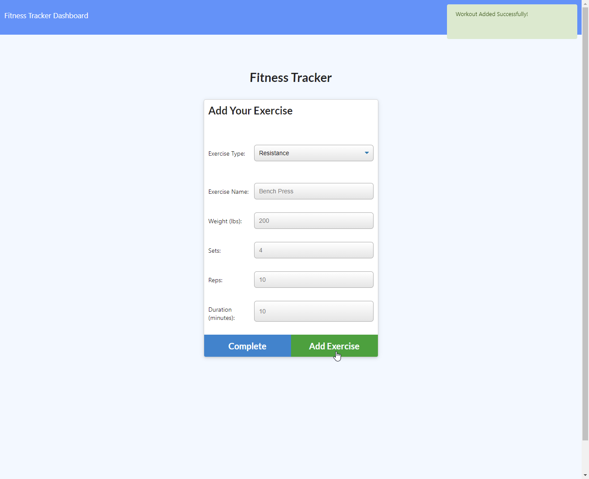

# Workout Plan

-----------------------
## Table of Contents
1. [Description](#description)
2. [Deployed link](#deployed-link)
3. [Code snippets](#code-snippets)
4. [Licenses](#licenses)
5. [Questions](#questions)

-----------------------
## Description
A basic fitness tracker that accounts for both cardio and resistance training. All of the figures from are taken and on the Dashboard section are added to graphs so users
can see what can be done in terms of improvement or challenge themselves or their friends.


-----------------------
## Deployed link
[Link](https://workoutplannnn.herokuapp.com/?id=6030a91118d32c002e99b623)

-----------------------
## Code snippets

```javascript
router.get("/api/workouts/range", (req, res) => {
    db.Workout.find({})
    .limit(10)
    .populate()
    .then(dbWorkout => {
        res.json(dbWorkout);
    }).catch(err => {
        res.json(err)
    })
});
```
In the api-routes.js file, this specific api-route finds and populates a range of Workouts. The ".limit" code sets the parameter for the quantity of workouts are printed in
the JSON object on the "api/workouts/range" page. This allows users to view the full list of their past workouts to see what they can possibly improve on or change if need be.

-----------------------
## Licenses
This project uses a [MIT License](https://opensource.org/licenses/MIT). 

-----------------------
## Questions
Created by Michael Medina

If you have any questions you can reach me at the following: 


[michaelanthony.medinaa@gmail.com](mailto:michaelanthony.medinaa@gmail.com)  |[LinkedIn](https://www.linkedin.com/in/michaelanthonyy/) | [GitHub](https://github.com/michaelanthonyyy)  |

